# Cybersecurity Pre-Work - *Yu Xuan Huang* 

Time spent: **0.6** hours spent in total 

## User Stories

The following functionality is completed:

1.  [x]  Hidden Employee
2.  [x]  Peculiar Employees
3.  [x]  Secret Number 1
4.  [x]  Hidden Car
5.  [x]  Hidden User
6.  [x]  Odd List
7.  [x]  The Riddler
8.  [x]  Secret Number 2
9.  [x]  Privilege Escalation
10. [x]  Secret Number 3
11. [x]  Key Players
12. [x]  Key Players 2
13. [x]  Bank Robbers
14. [x]  Bank Robbers 2
15. [x]  Bank Robbers 3

## Video Walkthrough

Here's a walkthrough of implemented user stories:

Hidden Employee:
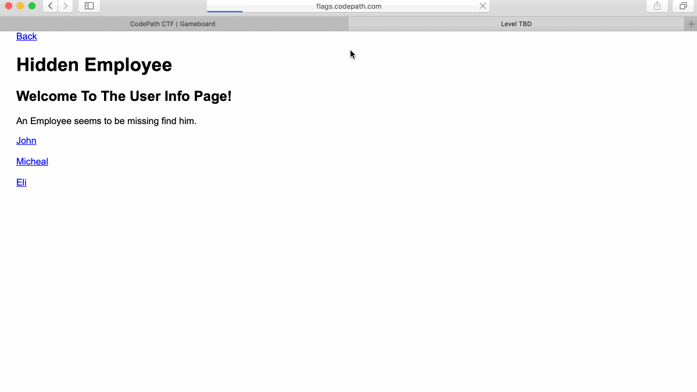

Peculiar Employees 
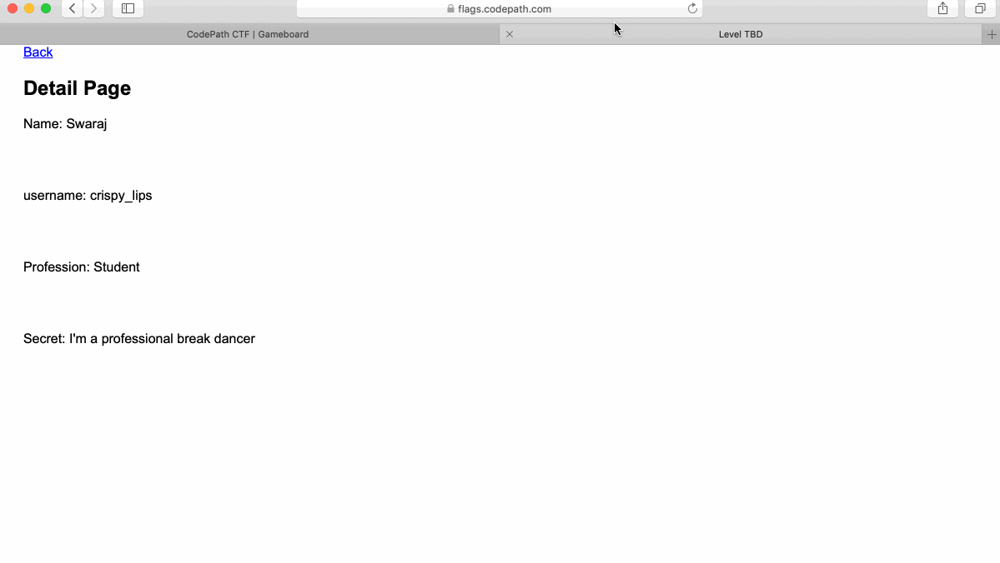

Secret Number 1
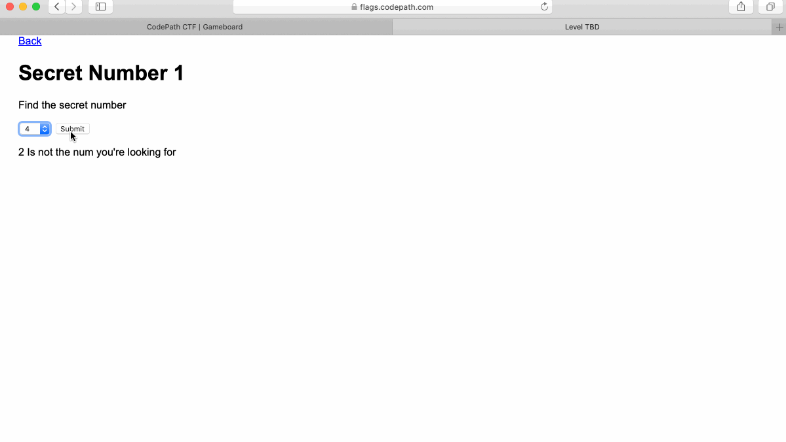

Hidden Car
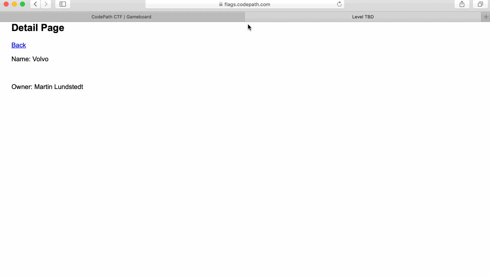

Hidden User 
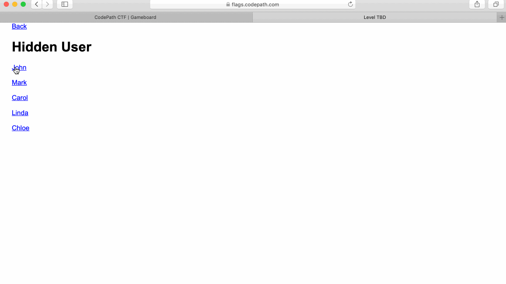

Odd List
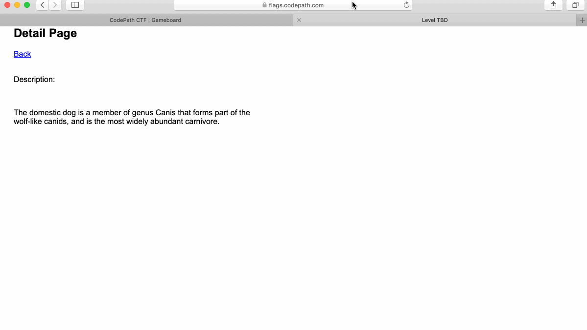

The Riddler 
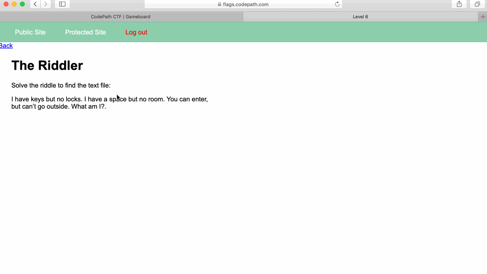

Secret Number 2
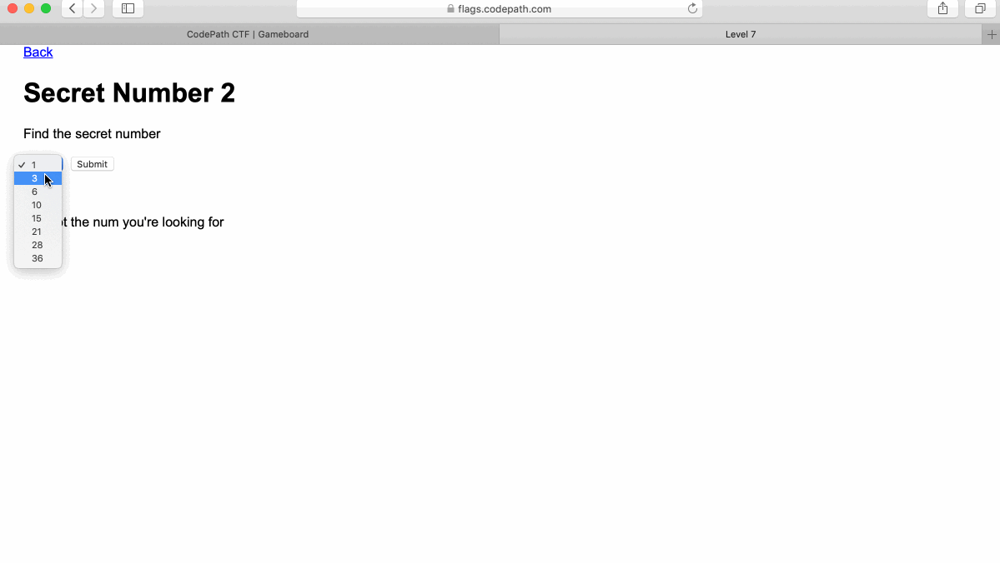

Privilege Escalation
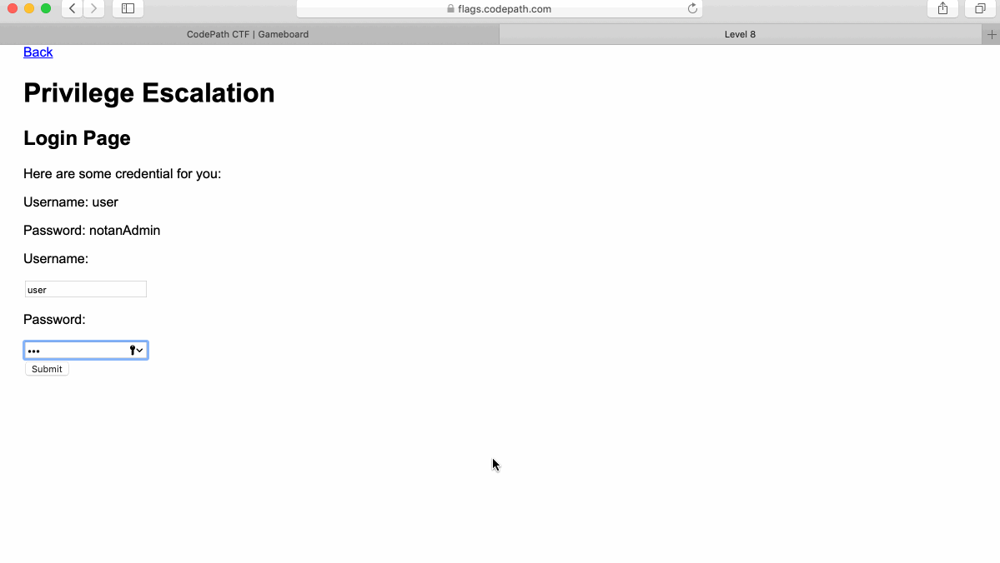

Secret Number 3
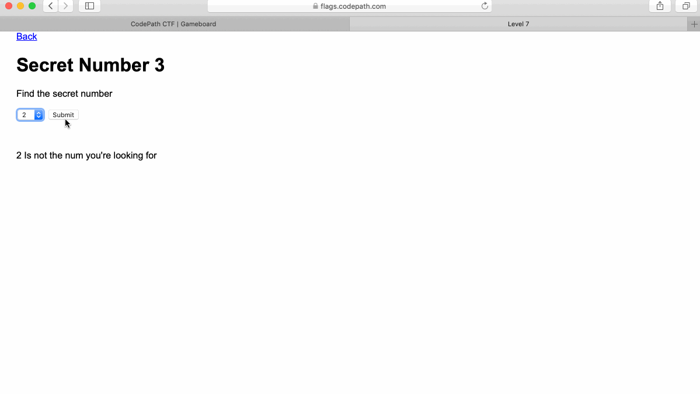

Key Players
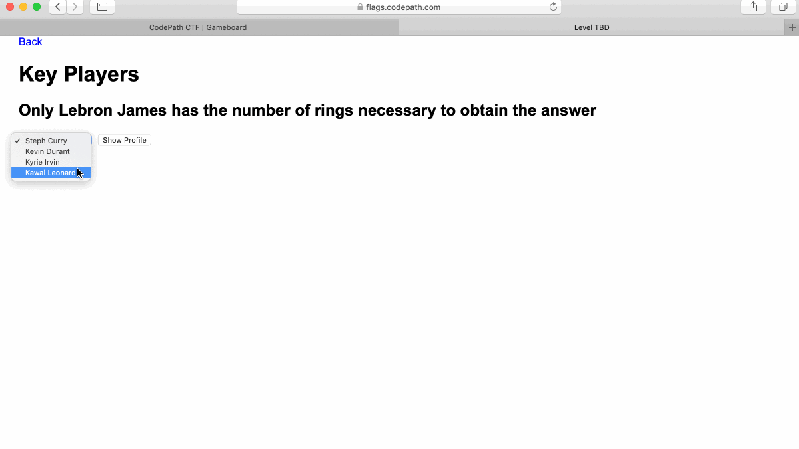

Key Players 2
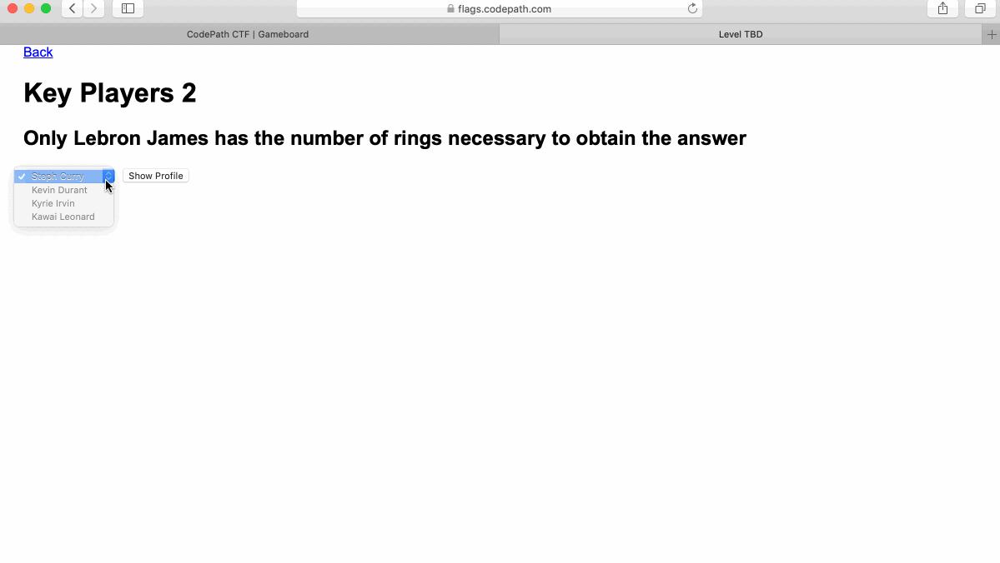

Bank Robbers
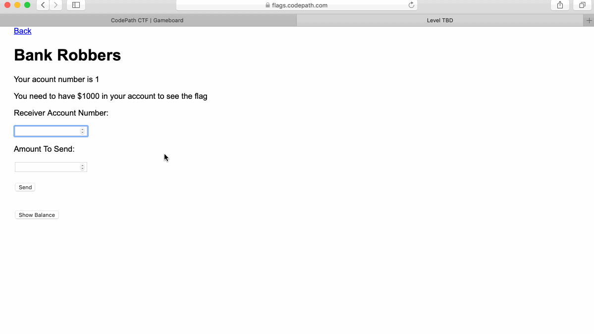

Bank Robbers 2
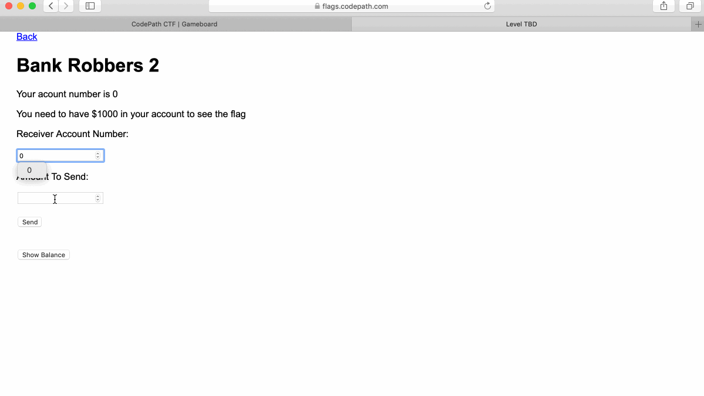

Bank Robbers 3
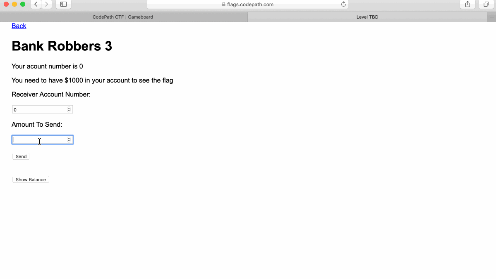

GIF created with [LiceCap](http://www.cockos.com/licecap/).

## Notes

This is exactly the same as the prevous lab.

## License

    Copyright [2019] [Yu Xuan Huang]

    Licensed under the Apache License, Version 2.0 (the "License");
    you may not use this file except in compliance with the License.
    You may obtain a copy of the License at

        http://www.apache.org/licenses/LICENSE-2.0

    Unless required by applicable law or agreed to in writing, software
    distributed under the License is distributed on an "AS IS" BASIS,
    WITHOUT WARRANTIES OR CONDITIONS OF ANY KIND, either express or implied.
    See the License for the specific language governing permissions and
    limitations under the License.
